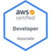

## [Damodar Vishwanath Shanke](http://au.linkedin.com/in/damodarshanke)     ([&#8595;](https://raw.githubusercontent.com/dshanke/dshanke.github.io/master/cv/CV_DamodarShanke.docx))
Sydney, NSW  
Phone: 0404 930 412  
Email: <d_shanke@yahoo.com>  

### AWS DevOps, Systems and Software Engineer  

---

- **AWS Cloud Managed DevOps** and **Automation**.

- Experience in **developing/migrating application from on premise onto
  AWS platform (EC2\|ASG\|ELB\|RDS\|Storage \[EBS\|EFS\|S3\]
  \|ECS\|SNS\|SES\|CloudFormation\|VPC\|Lambda\|API
  Gateway\|Cloudwatch\|etc.)**

- Automation using **Jenkins**, **Ansible**, **Jinja2, UNIX Shell
  Scripting**, **AWS CLI, SAM CLI, CloudFormation, Python, Hashicorp
  Terraform, Hashicorp Packer, Docker**

- Designed & Implemented Oracle Database 12.x on EC2 where the data
  files for the database is implemented on EBS volumes along with
  feature of creating database snapshots and recovery from database
  snapshots.

- Experienced in Software Analysis and Design, Requirements Gathering,
  Prototyping/Proof of Concept, Task Estimation, **Coding**, **Design
  Patterns**, **Performing Design Reviews** and **Code Reviews**,
  Software and Design Documentation, Test Automation, Unit Testing,
  Managing Change Controls.

- **Software Engineer (primarily C++ OOAD development** on both **UNIX**
  and **Windows platform & also worked with java\|C#\|vb.net\|python
  programming languages)** with more than 14 years’ experience in
  developing leading-edge solutions in security   mpliance and financial
  domain. progressing from problem statement to well-documented design
  and successful implementation there on. Migrating/Porting C++
  Application from Windows to UNIX platform and across inter UNIX
  platforms

- Experience of handling a group of 5-6 resources acting as their
  technical lead in addition to taking responsibility of estimation,
  task planning, and providing regular status updates to relevant stake
  holders.

- Results-oriented, intelligent, enthusiastic, self-starter and a
  committed software developer with proven ability to work creatively
  and analytically in a fast-paced problem-solving environment.

- Hands-on experience across all stages of software development life
  cycle (**SDLC**) using **Waterfall** and **Agile** (**SCRUM**)
  methodologies.

- Experience in working on high priority customer escalations and
  ensuring timely resolutions of such reported issues while supporting
  real-time distributed systems.

### **Technical Skills**

---

| **Area**                      | Expertise, Skills & Tools                                                                                                                                                                                                                                                                         |
|-------------------------------|---------------------------------------------------------------------------------------------------------------------------------------------------------------------------------------------------------------------------------------------------------------------------------------------------|
| **DevOps (AWS) & Automation** | **AWS services** (EC2 \|ASG \|ELB \|RDS \|Storage \[ EBS \|EFS \|S3\] \|EC\|SNS \|SES \|CloudFormation \|VPC \|Lambda \|API Gateway \|AWS CLI \| etc.) / Docker / Ansible / Jinja2 templating / Shell Scripting / Ruby, Python, Perl, Jenkins, Docker, Hashicorp’s Packer for baking AMIs         |
| **Languages**                 | **C, C++, C++11**, **C++/CLI,** Visual C++, .NET (**C#, VB),** SQL, SQL Stored Procedures, HTML, XML, Maintenance/Enhancements of Ruby, Python, Shell Scripts and Java applications.                                                                                                              |
| **Libraries / Frameworks**    | **STL**, Windows SDK, Windows API, MFC, .**NET**, SQLite, BSD Socket library, Winsock, open-source packages (ICU, boost, gsoap, tinyxml, openssl), BEA Tuxedo, google test, AWS Development Tools                                                                                                 |
| **IDE and Tools**             | Visual Studio 2010/12/13, VC++, nMake, msbuild, gcc, gmake, gdb, Source Control (VSS, SVN, CVS, Perforce), doxygen, Coverity (static analysis tool), Valgrind (dynamic analysis tool – memory profiling), Bulls Eye code coverage, Eclipse, Netbeans, SlickEdit                                   |
| **Concepts**                  | OOA/OOD (UML, Design Patterns, Refactoring), Multithreading/Multiprocessing, Socket Programming, Obfuscation, Encryption, Data Structures, Algorithms, Cloud Computing                                                                                                                            |
| **Systems**                   | Windows 2003/2008 (R2)/2012/7/8, UNIX (Linux, Solaris SPARC)                                                                                                                                                                                                                                      |
| **Databases**                 | **Oracle** 9/10/12, MS SQL 2000/2005/2008 (R2), MySQL, SQLite, Sybase                                                                                                                                                                                                                             |

---
### **Awards & Recognition**

- Received multiple awards at NAB. This also includes an **MVP** (most
  valuable player in last quarter of 2018) and the Quarterly award for
  the quarter in which I revived the database partitioning process and
  for quick fix of a non-severe but irritating bug which was logging
  many incidents against our application and the fix for which was not
  being prioritized due to high estimates that were attached to it.

- Received multiple awards at various levels \[L1/L2/L3/L4 (highest)\]
  at Symantec in Year 2008/2009/2012/2013 for performance and
  pro-actively resolving customer issues.

- Received ‘Valuable contribution Award’, at iGate (Patni) for the
  quarter January 2005 to March 2005 for the contributions made on
  crucial projects.

---
### **Career highlights and achievements**

- Built the Redshift service stack in [ZAZ(Spain)](https://aws.amazon.com/blogs/aws/now-open-aws-region-in-spain/) and
  [ZRH(Zurich)](https://aws.amazon.com/blogs/aws/a-new-aws-region-opens-in-switzerland/)
  Region.

- Designed and migrated work loads of on-premises application to AWS
  with monitoring, backup and restore solution using AWS services and
  ansible & shell scripts for automation/provisioning, which now allows
  to stand multiple environments at will within matters of few minutes.
  The solution also includes a home-grown Oracle Database on EC2
  solution with ability to create snapshots & restore/recover from those
  snapshots.

- Successfully **designed and implemented** the complex MITR Tax regime
  rules mandated by ATO in Unison Unit Pricing application. Reduced the
  initially estimated waterfall model estimates by 50% by adopting an
  agile prototype driven approach which allowed early testing of
  application.

- Designed and implemented integration of Reputation technologies in
  CSAPI (Content Scanning APIs) component which is the core scanning
  component of Symantec Protection Engine, during a period of resource
  crunch without affecting delivery timelines. While working on this new
  module, detected and fixed an underlying design issue in existing core
  modules due to which files were being copied and scanned more than
  once. This reduced the scan cycles by 30%.

- Enhanced performance by 50% in the Enterprise Security Manager’s
  Account information module by implementing local cached with TTL,
  avoiding redundant LDAP calls.

- Implemented password hash generation algorithm in Sybase 15.x only by
  looking at the somewhat vague documentation provided by Sybase. The
  algorithm was used for detecting weak password using dictionary-based
  cracking.

- Introduced, Conceptualized, and implemented an application module in
  Enterprise Security Manager compliance product which implemented and
  used the VMWare’s vSphere Web service, for the purpose of retrieving
  compliance & security data which help with auditing the VMware
  infrastructure.

### **Professional Experience**

---
**[Amazon](https://www.amazon.com.au/), Sydney**

---
**Designation**: System Development Engineer II (Since May 2021)

I am part of the global AWS Redshift Service Team. Redshift is the
leading cloud data warehouse database for Business Intelligence and
Analytics. Accustomed to deal with thousands of transactions per second
in datacenters distributed worldwide in systems designed for high
scalability and fault tolerance.

- The following tasks are performed as part of daily activities:  
  Building Redshift stacks for new Regions (Data Centers) and
  deployment, Continuous improvement of process via Automation thereby
  Reducing time to market.

- The System development stacks comprises of wide variety of languages
  such as Java, Ruby (for infrastructure automation), Python and Shell
  Scripting.

- Develop solutions using AWS services like DynamoDB, RDS Postgres, EC2,
  Lambda, SWF

- Involved in production support (SRE / Sev2 handling) to keep customer
  clusters available according to SLA with minimum RTO, troubleshooting
  recurrent problems to reduce operational workload and identifying,
  proposing & developing solutions to fix common issues.

  - Create and review designs for new features being released to the
    customers using Continuous Integration – Continuous Development
    pipelines.

  - Reviews code produced by team members to improve readability,
    consistency, coverage, and best practices

---
[**Cevo**](https://cevo.com.au/), **Sydney**

---
**Designation**: AWS Consultant (Feb 2021 - May 2021)

My role was to help implement solutions using AWS services for Cevo
clients. I worked at AMP during this tenure.

I was directly involved in helping AMP Business team, insource back
their Generation 1 Cloud infrastructure stack which was manually managed
by an external vendor.

The insourcing included automated management and monitoring of AWS cloud
resources and improving the permission model of the resources. In
addition to that the handover documents were prepared with adequate
processes put in place to manage the lifecycle of the insourced systems.

---
**[National Australia Bank](https://www.nab.com.au/), Sydney**

---
**Designation:** Senior Analyst Engineer / Senior Consultant, Cloud Engineering (**Since October 2014**)

- Migrating multiple On-Premises Application from to AWS Platform.

- Designed and Contributed to Architecture of Prod and non-prod AWS
  Environments.

- Also implemented solutions for hybrid environments where Prod workload
  is hosted on premise Datacenter and non-prod workload is hosted on AWS
  platform.

- Implemented Ansible, CloudFormation & Jinja2 based Automation to
  deploy infrastructure as code.

- Implemented Automation of Deployment of new releases for long lived
  environments (This was a necessity with Hybrid setups)

- Design, development, testing, documentation, maintenance & support of
  Unison Application which is MLC Wealth’s primary Unit Pricing
  Application.

- Liaising closely with business stakeholders as well as providing
  support to the live environment, including the quick resolution of
  potential issues that interrupted critical business processes.

- **Tools & Libraries:** C/C++ \| C# \| VB.NET \| STL \| Visual Studio
  2010 \| NetBeans \| Make \| xlc \| idebug \| AIX \| Linux \| Oracle \|
  TOAD \| SQL \| PL/SQL \| Shell scripting \| ControlM \| Remedy \| AWS
  \[EC2 / RDS\] \| Bea Tuxedo \| AWS EC2 \| AWS S3 \| AWS \*

---
**WMS Gaming, Sydney** – *is a leading global innovator in the design,
manufacture and distribution of electronic and digital gaming
entertainment and gaming machines for the casino industry.*

---

**Designation:** Senior Software Engineer (**Mar 2014 – October 2014**)

- Developed standalone reel slot games – CoronadosGold, RedEagle,
  FarEastFortuneDeluxe

- Development of reel slot games using C++, proprietary framework and on
  customized embedded OS.

- Designing interfaces and implementing new modules (libraries).

- Implementing the User Interface based on MVC Design pattern.

- Working on reliability and performance areas by detecting and fixing
  memory leaks using tools such as Visual Leak Detector, Valgrind, etc.

- **Tools & Libraries:** C/C++ \| Boost \| STL \| Python \| Perl \|
  Slick Edit \| NetBeans \| Make \| gcc \| gdb \| UNIX (CentOS) \| CVS

---
**Symantec CORP, India** – *is a multibillion-dollar American computer
security, backup and availability solutions Software Corporation
headquartered in Mountain View, California, United States*

---
**Designation:** Software Engineer / Senior Software Engineer /
Principal Software Engineer (**Nov 2006 to Jan 2014**)

- Worked on Symantec’s flagship security compliance product which are
  implemented in C++ on Windows and UNIX platforms

  - CSAPI component – Content Scanning API is a façade to various
    scanning technologies and provides easy to use interface to the
    consumers.

  - Control Compliance Suite (CCS) – CCS is an agentless security
    compliance enterprise product which works in a distributed
    environment.

  - Enterprise Security Manager (ESM) – ESM is cross-platform
    agent-based security compliance enterprise product which works in a
    distributed environment.

- Worked as a team lead as well as individual contributor on multiple
  deliverables.

- Designed interfaces and modules from scratch in C++ (Windows and UNIX)
  following SDLC phases.

- Worked on reliability and performance areas by detecting and fixing
  memory leaks using tools such as Visual Leak Detector, Valgrind, etc.

- Worked on optimization of scan algorithms (CSAPI) for high throughput
  by avoiding creation of multiple copies of files.

- Fixed race conditions in multi-threaded environment within ESM Agent’s
  job management module.

- Worked on compiler upgrades (C++) for product components as well as
  legacy/third party components.

- Ported 32-bit C++ products to 64-bit environment.

- Migrated C++ application to support newer versions of MS SQL, Oracle,
  and Sybase

- Developed new C++ client module from scratch on Linux platform using
  the WSDL files provided by VMware vSphere Web Service SDK to interact
  with the vSphere Web Service.

- Worked on C# and developed C++/CLI module which allowed reuse of C++
  native libraries (static and dynamic) in managed application on
  Windows platform.

- **Tools & Libraries:** C/C++ \| C# \| Python \| Perl \| MS SQL \|
  Sybase \| Oracle \| MySQL \| Visual Studio \| Make \| gcc \| gdb \|
  UNIX (Solaris / Linux) \| Windows OS \| Java \| Eclipse \| Perforce \|
  Valgrind \| Coverity

---
**Tech Mahindra Limited, India** – *is a \$2.9 billion company with over
87,300+ professionals, its proven global delivery models, distinctive IT
skills and decades of domain expertise help clients realize their
business aspirations.*

---
**Designation:** Senior Technical Associate

- Worked on dialogue based MFC ‘Bulk Sealer’ application using VC++. The
  bulk sealer utility transformed data and source files into proprietary
  customized protected format.

- Worked on context sensitive screen capture protection feature using
  Windows APIs and hooking techniques.

---
**iGate (erstwhile PATNI), India** – *is a NASDAQ-listed,
US-incorporated outsourcing company which provides information
technology, consulting, and business process outsourcing (BPO)
services.*

---
**Designation:** Senior Software Engineer

**Tools & Libraries:** C \| C++ \|STL\| VC++\| Rhapsody in C++ \| MFC \|
Multithreaded programming \| winsock library for socket programming \|
TCP/IP \| SQLite 3.x.x library \| Tortoise SVN & WinCVS for version
control.

**Projects**:

- **PCL Printer Testing \[Team Size: 9\] - For U.S based client
  manufacturing Printers**

> **Duration:** Apr 2006 – Aug 2006

- Designed and developed test suite using C++ and PCL (printer command
  language) programming.

<!-- -->

- **MXIP PROJECT (Team Size: 4) – For Japanese client specialized in
  optics and imaging products**

> **Duration: Jan 2006 – April 2006**

- Designed and implemented data structures and Blob analysis algorithms
  in C++ as a part of the image processing library.

- Designed and implemented C++ console-based test automation tool for
  the image processing library.

<!-- -->

- **MC 14 LCD Panel Manager (Team Size: 2) – For Japanese client
  specialized in imaging and electronics**

> **Duration: Sep 2005 - Jan 2006**

- Designed and implemented different modules of the interface, using
  Rhapsody in C++.

- Used Rhapsody modelling tool to create numerous state and transition
  diagrams and did event-based programming in C++.

<!-- -->

- **HDMI Key Provisioning (Team Size: 3) – For U.S based client
  specialized in multinational digital technology**

> **Duration: Mar 2005 – Aug 2005**

- Developed multithreaded client server application using C++ and
  winsock library and which catered to request based automated HDMI key
  provisioning mechanism to a Digital Multimedia embedded system.

- Developed dialogues-based GUI tools using MFC and VC++ to manage the
  HDMI keys. It provided features like Delete, Restore, Import, and
  Export and to show live statistics of key provisioning server.

<!-- -->

- **PolicyCAD 1.0 (Team Size: 5) – For U.S based client specialized in
  identity-driven access management solutions**

> **Duration: Jan 2005 - Mar 2005**

- Implemented the dialogue based PolicyCAD tool using MFC and VC++ which
  displayed user objects fetched from Active Directory and allowed to
  map it against various policies.

<!-- -->

- **3DViewer MDI App. (Team Size: 5) - For Japanese client who are
  specialized in producing sensors, barcode readers, vision systems,
  measuring equipment and digital microscopes**

> **Duration: Sep 2004 - Jan 2005**

- Migrated SDI application to multi-threaded MDI application using MFC
  and VC++

- Added thread safety to the multithreaded application which now took
  care of multiple data stack (images).

---
**Phil Systems, Goa, India** – *a product-based startup which focused on
photo id software.*

---
**Management Trainee (Programmer),** Mar 2004 to Aug 2004

- **Smart Card Integration into EasyCard Product (Team Size: 1)**

  - Implemented C++ interface-oriented library into which various Smart
    card library could be plugged in to cater to smart card readers from
    variety of vendors.

---
### **Education**

- B.E. Computer Engineering, August 2003. R.M.C.E.T, University of
  Mumbai.

- Diploma in Computer Engineering, October 1998. Agnel Polytechnic, Goa.
  (Goa Board of Technical Education).

---
